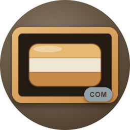
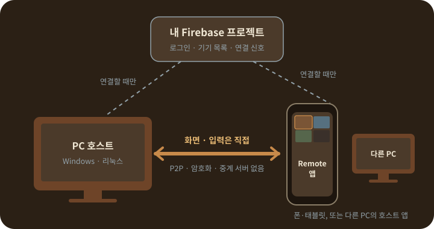

<p align="center">
  
</p>

<h1 align="center">Remote</h1>

<p align="center">
  <a href="https://blackbuddle.github.io/Remote-releases/"><b>소개 페이지</b></a>
  &nbsp;·&nbsp;
  <a href="https://github.com/BlackBuddle/Remote-releases/releases/latest"><b>최신 버전 받기</b></a>
  &nbsp;·&nbsp;
  <a href="#처음-설정-한-번만">처음 설정</a>
  &nbsp;·&nbsp;
  <a href="#자주-묻는-질문">자주 묻는 질문</a>
</p>

<p align="center">
  <b>내 PC 여러 대를, 폰 한 화면에서 보고 조작합니다.</b><br>
  안드로이드 폰·태블릿이나 다른 PC에서 · 서버 비용 없이 내 Firebase로 · 화면과 입력은 기기끼리 직접
</p>

<p align="center">
  
</p>

---

## 1.0.7에서 새로워진 것

- **여러 PC 동시 보기** — 최대 9대를 체크해서 한 화면에 나눠 봅니다. 고른 수에 맞춰 격자가 저절로 바뀌고, 칸마다 따로 확대하거나 한 칸만 크게(1×1) 볼 수 있습니다.
- **탭한 곳으로 커서** — "직접 터치" 모드에서는 탭한 자리로 커서가 가서 클릭합니다. 지금까지의 "터치패드" 모드와 메뉴에서 전환합니다.
- **조합 키 시트** — Win, Alt+Tab, Win+D, Win+Shift+S, Ctrl+Shift+Esc, 한/영 같은 조합을 버튼 하나로 보냅니다.
- **PC에서 다른 PC 보기** — 호스트 앱 안의 "다른 PC 보기" 창에서 같은 계정의 다른 PC를 보고 조작합니다.
- **화질 고르기** — Wi-Fi·모바일 데이터 기본값, PC별 화질, PC가 보낼 최대 화질.
- **폰에서 PC 끄기** — 확인 창, 30초 카운트다운, 그동안 취소 가능.
- **WinLocker와 함께** — 원격 PC가 잠기면 칸에 잠김을 표시하고 입력을 막습니다. 다른 기기가 같은 PC에 연결하면 알려 줍니다.
- **테마 색 바꾸기** — 기본·밝게·고대비·남색, 8가지 색을 색상환으로 바꿔 내 테마를 여러 개 저장합니다(앱·호스트 모두).
- **모니터 고르기** — 모니터가 여러 대인 PC에서 칸 이름 줄의 [🖥 n ▾]로 모니터 1·2…를 골라 봅니다. PC마다 마지막 선택을 기억하고, 새로 연결하면 주 모니터부터 보입니다. 모니터가 한 대뿐인 PC나 1.0.6 이하 호스트에서는 버튼이 보이지 않습니다.
- **설정 메뉴 정리** — 앱과 호스트의 ⚙ 메뉴를 네 묶음으로 나눴습니다.

<p align="center">
  
</p>

## 어떤 프로그램인가요

PC에 **Remote Host**(호스트)를, 안드로이드 기기에 **Remote 앱**을 설치하면 폰에서 PC 화면을 실시간으로 보면서 마우스와 키보드로 조작할 수 있습니다. 1.0.7부터는 여러 PC를 한 화면에 함께 보고, PC에서 다른 PC를 볼 수도 있습니다.

- 같은 구글 계정으로 로그인한 PC가 폰의 목록에 나타나고, 고르면 1초 남짓 만에 연결됩니다. IP 주소를 입력하거나 기기를 짝지을 필요가 없습니다.
- 화면과 입력은 PC와 폰이 **직접(P2P)** 주고받습니다. 연결을 시작할 때의 짧은 신호만 **내가 만든 Firebase 프로젝트**를 거치고, 개발자가 운영하는 서버는 없습니다.
- 폰에서 PC를 재시작하고 다시 연결하는 등, 사람이 PC 앞에 없어도 계속 쓸 수 있게 만들었습니다.

<p align="center">
  
</p>

## 주요 기능

**보고 조작하기**
- PC 화면을 원래 해상도(최대 3840×2160, 초당 30장)로 보여 줍니다. 두 손가락으로 확대·이동할 수 있습니다.
- **터치패드** 모드: 화면을 끌면 커서가 움직이고, 탭하면 클릭합니다. **직접 터치** 모드: 탭한 자리로 커서가 가서 클릭하고, 누른 채 끌면 그 자리에서 끌어 옮깁니다.
- 세로 화면에서는 씽크패드 배열의 가상 키보드와 트랙포인트, 좌·중·우 클릭, 드래그 고정, **한/영** 키를 씁니다. **조합** 버튼으로 Win·Alt+Tab 같은 조합 키를 보냅니다. 폰에 연결한 블루투스·USB 키보드도 그대로 PC에 전달됩니다.

**여러 PC**
- 최대 9대를 골라 한 화면에 나눠 봅니다(1·2·4·6·9대 → 1×1·1×2·2×2·2×3·3×3, 세로 화면에서는 가로·세로가 바뀝니다).
- 칸마다 따로 확대하고, 이름 줄의 1×1 버튼으로 한 칸만 크게 봅니다. 마우스·키보드와 메뉴의 명령은 테두리가 있는 칸(포커스한 PC)으로만 갑니다.
- PC 호스트의 **다른 PC 보기** 창에서도 같은 격자로 다른 PC를 봅니다.

**연결**
- 같은 계정의 PC 목록에서 켜진 PC(초록 점)를 골라 연결합니다. 꺼진 PC는 "마지막 접속 N분 전"으로 보입니다.
- 연결이 끊기면 칸마다 따로 자동으로 다시 연결합니다.
- 화질은 Wi-Fi·모바일 데이터별 기본값, PC별 값, 칸의 화질 버튼(이번 연결만)으로 고르고, PC 쪽에서 보낼 최대 화질을 정합니다.

**PC 관리**
- 호스트는 창을 닫아도 트레이에서 계속 동작하고, PC를 켤 때 자동으로 시작하게 할 수 있습니다.
- 폰에서 PC를 **재시작**하거나 **끄고**(PC에서 허용한 경우), 재시작 뒤 PC가 다시 켜지면 저절로 다시 연결합니다.
- **WinLocker**(별도의 화면 잠금 프로그램)를 쓰는 PC라면 원격 PC의 잠김을 칸에 표시하고, 폰에서 잠금을 풀고 다시 잠글 수 있습니다(PC에서 허용한 경우).
- 새 버전이 나오면 호스트가 미리 받아 두고, PC나 폰에서 버튼 한 번으로 **자동 업데이트**합니다.
- 호스트와 앱 모두 이번 달 Firebase 사용량을 그래프로 보여 줍니다.
- 앱과 호스트의 색을 **테마**로 바꿉니다.

## 다운로드

[최신 릴리즈](https://github.com/BlackBuddle/Remote-releases/releases/latest)에서 받습니다.

| 파일 | 설치할 곳 |
|---|---|
| `Remote.Host-x.y.z.msi` | Windows PC (권장) |
| `Remote.Host-x.y.z.exe` | Windows PC (같은 내용의 실행형 설치 프로그램) |
| `RemoteApp-vx.y.z-release.apk` | 안드로이드 폰·태블릿 |
| `remote-host_x.y.z-1_amd64.deb` | 리눅스 PC (우분투 24.04, 실험적 — 아래 "리눅스 PC" 참고) |

**준비물**
- Windows 11 PC(64비트)에서 확인했습니다. 리눅스는 우분투 24.04(Xorg 세션)에서 확인했습니다(실험적).
- Android 7.0 이상 폰·태블릿
- 구글 계정
- 내 Firebase 프로젝트(무료 요금제로 충분합니다 — 아래 "처음 설정"에서 만듭니다)

## 처음 설정 (한 번만)

Remote는 개발자의 서버나 Firebase를 쓰지 않고, **각자 자기 Firebase 프로젝트**를 만들어 씁니다. 호스트와 앱에는 **같은 프로젝트**의 값을 넣어야 서로를 찾습니다. 처음 한 번 10~20분쯤 걸립니다.

1. [Firebase 콘솔](https://console.firebase.google.com)에서 새 프로젝트를 만듭니다.
2. **Authentication → 로그인 방법**에서 **Google**을 사용 설정합니다.
3. **Realtime Database**를 만듭니다(빌드 → Realtime Database → 데이터베이스 만들기, 지역 선택, **잠금 모드**로 시작). 만든 뒤 '데이터' 탭 맨 위의 **주소**(`https://…firebaseio.com` 또는 `https://…firebasedatabase.app`)를 복사해 둡니다.
4. **규칙** 탭에 아래 내용을 붙여넣고 게시합니다. 로그인한 사람이 자기 데이터만 읽고 쓰게 하는 규칙입니다.

   ```json
   {
     "rules": {
       "users": {
         "$uid": {
           ".read": "auth != null && auth.uid === $uid",
           ".write": "auth != null && auth.uid === $uid"
         }
       }
     }
   }
   ```

5. **프로젝트 설정 → 내 앱**에서 **Android 앱**을 추가합니다. 패키지 이름은 `black_buddle.remoteapp`이고, 아래 **SHA-1 인증서 지문**도 등록합니다. 이 지문은 배포되는 APK에 고정된 공개 값이라 누가 설치하든 같습니다(비밀 값이 아닙니다).

   ```
   SHA-1:   31:E6:CF:E9:D0:B6:59:C7:CE:A1:3D:E9:69:5E:D8:6C:ED:2E:B2:6E
   SHA-256: B3:E6:55:00:E8:2B:C5:1C:5E:B4:D5:34:AF:58:65:50:E6:D1:66:EE:5C:04:F7:69:D4:C5:61:09:5C:26:4E:FE
   ```

6. [Google Cloud 콘솔](https://console.cloud.google.com)(같은 프로젝트) → **API 및 서비스 → OAuth 동의 화면**을 설정합니다. 앱 이름과 이메일만 넣으면 됩니다. 새 프로젝트는 **"테스트"** 상태로 시작하므로, **대상 → 테스트 사용자**에 로그인할 구글 계정을 추가하세요(또는 "프로덕션으로 게시" — 요청하는 권한이 이메일·프로필뿐이라 심사 없이 게시됩니다). 이걸 빠뜨리면 로그인할 때 "액세스 차단됨"이 뜹니다.
7. 같은 곳의 **사용자 인증 정보**에서 **OAuth 클라이언트 ID**를 하나 더 만듭니다. 유형은 **데스크톱 앱**이고, PC 호스트가 구글 로그인에 씁니다. 만들면 나오는 **클라이언트 ID**와 **클라이언트 보안 비밀**을 복사해 둡니다.
8. 호스트와 앱을 처음 실행하면 설정 화면이 뜹니다. 각 칸 아래에 "어디서 찾나요" 안내가 있습니다.

   | | 넣을 값 |
   |---|---|
   | PC 호스트 | 웹 API 키, 프로젝트 ID, Realtime Database 주소, 데스크톱 OAuth 클라이언트 ID와 보안 비밀 |
   | 안드로이드 앱 | Android API 키, 앱 ID, 프로젝트 ID, Realtime Database 주소, 웹 클라이언트 ID |

   - **API 키는 호스트와 앱이 서로 다른 것을 씁니다.** 호스트는 Google Cloud 콘솔 → 사용자 인증 정보의 **Browser key (auto created by Firebase)**, 앱은 **Android key (auto created by Firebase)** 입니다. 앱용 키는 Firebase 프로젝트 설정의 안드로이드 앱에서 `google-services.json`을 내려받아 `current_key` 값으로도 확인할 수 있습니다(파일 자체는 필요 없습니다).
   - 앱의 **웹 클라이언트 ID**는 사용자 인증 정보의 OAuth 클라이언트 중 **유형이 "웹 애플리케이션"인 것**(보통 "Web client (auto created by Google Service)")입니다. 7단계에서 만든 데스크톱용 ID를 넣으면 앱 로그인이 실패합니다.

## 설치

### PC (Remote Host)

1. `.msi`를 내려받아 실행합니다. 코드 서명이 없어서 Windows가 "Windows의 PC 보호" 창을 띄울 수 있습니다. **추가 정보 → 실행**을 누르세요.
2. 설치 뒤 시작 메뉴에서 **Remote Host**를 실행하고, 설정 화면에 값을 넣은 뒤 **Google로 로그인**합니다.
3. 처음 실행하면 PC를 켤 때 자동으로 시작할지 묻습니다. 원격으로만 쓰는 PC라면 켜 두세요.

이미 설치된 호스트를 직접 업그레이드할 때는 **트레이의 Remote Host 카드에서 "호스트 종료"를 먼저 누른 뒤** 설치하세요. 켜진 채로 설치하면 파일이 사용 중이라 실패할 수 있습니다. 1.0.4부터는 아래 "자동 업데이트"로 올라가므로 이 과정이 필요 없습니다.

### 리눅스 PC (실험적)

1. **로그인 세션을 Xorg로 바꿉니다.** 우분투 기본 세션(Wayland)에서는 폰이 붙을 때마다 "화면 공유" 승인 창이 떠서 원격으로 쓸 수 없습니다.
   - 로그인 화면에서 사용자 이름 → 비밀번호 칸 옆 톱니바퀴 → **Ubuntu on Xorg**
   - 자동 로그인을 쓴다면 로그인 화면이 건너뛰어지므로 아예 Xorg로 고정하세요(적용하려면 재부팅):
     ```bash
     sudo sed -i '/^\[daemon\]/a WaylandEnable=false' /etc/gdm3/custom.conf
     ```
2. `.deb`를 내려받은 폴더에서 설치합니다(`x.y.z`는 내려받은 파일의 버전):
   ```bash
   sudo apt install ./remote-host_x.y.z-1_amd64.deb
   ```
3. 앱 목록에서 **Remote Host**를 실행하고(또는 `"/opt/remote-host/bin/Remote Host"`), 설정 값을 넣은 뒤 **Google로 로그인**합니다. 로그인 페이지가 깨져 보이면 Firefox를 기본 브라우저로 지정하세요:
   ```bash
   xdg-mime default firefox_firefox.desktop x-scheme-handler/http x-scheme-handler/https
   ```
4. 한글이 네모(□)로 보이면 `sudo apt install fonts-noto-cjk`, 한글을 입력하려면 `sudo apt install ibus-hangul`을 설치하세요.

새 버전으로 올릴 때도 같은 명령으로 설치한 뒤 로그아웃했다 다시 로그인하거나 재부팅하면 새 버전으로 켜집니다. 리눅스 호스트에는 자동 업데이트, PC 잠금 해제·재잠금(WinLocker), 한/영 키가 없습니다(모두 Windows 전용).

### 안드로이드 (Remote 앱)

1. `.apk`를 폰에서 내려받아 엽니다. 처음이면 "출처를 알 수 없는 앱 설치"를 허용하라는 안내가 나옵니다.
2. 앱을 열어 설정 화면에 값을 넣고, PC와 **같은 구글 계정**으로 로그인합니다.

## 사용법

### 연결하기

1. PC에서 호스트가 로그인된 상태인지 확인합니다(트레이 아이콘에 마우스를 올리면 "온라인 · 대기 중").
2. 폰 앱 오른쪽 위의 **⚙** 를 눌러 메뉴를 열고 **🔌 PC 선택**을 누릅니다. 초록 점이 붙은 PC를 체크하고 **[연결]**을 누릅니다. 여러 대를 체크하면 한 화면에 나눠 보이고, 체크를 풀면 그 PC의 연결을 끊습니다.
3. 화면을 끌거나 탭해서 조작합니다(아래 "터치 방식"). **⌨** 버튼은 가상 키보드를 엽니다(세로 화면).

### 여러 PC를 한 화면에

- 최대 9대까지 고를 수 있고, 꺼진 PC는 새로 고를 수 없습니다. 한 대만 체크하면 지금까지처럼 한 대 보기입니다.
- 고른 수에 맞춰 1×1·1×2·2×2·2×3·3×3으로 배치합니다. 화면을 돌리면 다시 맞춥니다.
- 마우스·키보드와 메뉴의 명령은 **테두리가 있는 칸(포커스)** 으로만 갑니다. 다른 칸을 처음 누르면 포커스만 옮기고 아무것도 보내지 않습니다.
- 칸 위쪽 이름 줄에 PC 이름·연결 상태·잠김(🔒)·"구버전" 표시, **1×1** 버튼(그 칸만 크게), **화질** 버튼, 모니터가 여러 대인 PC에는 **[🖥 1 ▾]** 버튼이 있습니다.
- 칸마다 두 손가락으로 따로 확대합니다. 1×1로 숨긴 칸은 연결을 유지한 채 가장 낮은 화질로 쉽니다.
- 연결 문제는 그 칸 안에만 표시되고, 칸마다 따로 다시 연결합니다.

### 터치 방식과 키보드

- ⚙ 메뉴 **[입력·화면] → 🖐 터치 방식**에서 고릅니다.
  - **터치패드**: 화면을 끌면 커서가 움직이고, 탭하면 클릭합니다.
  - **직접 터치**: 탭한 자리로 커서가 가서 클릭하고, 누른 채 끌면 그 자리에서 눌러 끌어 옮깁니다.
  - 두 손가락 확대·이동은 두 방식 모두 앱 안에서만 동작합니다. 직접 터치를 못 쓰는 옛 호스트의 PC는 그 PC만 터치패드로 동작하고 이유를 알려 줍니다.
- 가상 키보드의 **조합** 버튼은 조합 키 시트를 엽니다. 누르면 포커스한 PC로 바로 보냅니다.

  | 묶음 | 키 |
  |---|---|
  | 창·작업 | Win, Alt+Tab, Win+Tab, Alt+F4, Alt+Esc |
  | Win 조합 | Win+D, Win+E, Win+R, Win+X, Win+I, Win+V, Win+Shift+S, Win+L |
  | 시스템 | Ctrl+Shift+Esc, PrtSc, Alt+PrtSc |
  | 입력기 | 한/영, 한자 |

  Ctrl+Alt+Del은 보낼 수 없습니다(아래 "자주 묻는 질문").

### 화질

| 단계 | 해상도 상한 | 초당 장 수 |
|---|---|---|
| 원본 | 3840×2160 | 30 |
| 높음 | 1920×1080 | 30 |
| 보통 | 1280×720 | 30 |
| 낮음 | 1280×720 | 15 |
| 절약 | 854×480 | 10 |

- 앱은 **Wi-Fi용(기본 높음)** 과 **모바일 데이터용(기본 보통)** 기본값을 따로 둡니다(⚙ 메뉴 **📺 기본 화질**). 연결 중 네트워크가 바뀌면 그에 맞춰 다시 요청합니다.
- 칸의 **화질** 버튼으로 이번 연결만 바꾸거나, 같은 창에서 "이 PC 기본값으로 저장"을 고릅니다.
- PC 호스트의 ⚙ 메뉴 **이 PC가 보낼 최대 화질**이 위 요청보다 우선합니다. 칸이 작으면 칸 크기에 맞춰 더 낮춰 보냅니다.

### 테마

- 앱은 ⚙ 메뉴 **[입력·화면] → 🎨 테마**, 호스트는 ⚙ 메뉴 **[프로그램] → 테마**에서 엽니다.
- **기본**(지금 색), **밝게**, **고대비**, **남색**이 들어 있고, 목록에서 누르면 바로 바뀝니다.
- **+ 새 테마**로 배경, 메뉴·카드, 버튼, 글자, 보조 글자, 강조, 키보드 키, 위험 — 8가지 색을 색상환이나 HEX 값으로 바꿔 저장합니다. 여러 개 만들 수 있고, 기기마다 따로 저장합니다.

### PC에서 다른 PC 보기

- 호스트 ⚙ 메뉴 **[이 PC에서] → 다른 PC 보기**나 트레이 카드에서 엽니다. 같은 계정의 다른 PC가 목록에 뜨고(자기 PC는 빠짐), 체크한 PC를 격자로 봅니다.
- 칸을 **클릭해야** 그 칸으로 마우스가 켜집니다. 올려놓기만 해서는 원격 커서가 움직이지 않습니다. 휠은 원격 PC로 보내고, 확대는 칸의 + / − / 맞춤 버튼으로 합니다.
- 위쪽 툴바에 수정키 고정(Ctrl·Alt·Shift·Win), 조합 키, 원격 명령(잠금 해제·재잠금·다시 시작·업데이트·PC 종료), 화질이 있습니다. 모두 포커스한 칸에 적용됩니다.
- 내 PC가 잠기면 입력 전달을 멈추고 눌린 키를 모두 뗍니다. 이 창은 맨 위에 고정되거나 키보드를 가로채지 않습니다.

### 폰 메뉴

| 묶음 | 버튼 | 하는 일 |
|---|---|---|
| 계정 | 로그아웃, 자동 로그인 | 로그인 상태를 바꿉니다 |
| 연결 | 🔌 PC 선택 | 같은 계정의 PC 목록을 열어 볼 PC를 고릅니다 |
| | 📊 사용량 | 이 폰의 Firebase 다운로드 사용량을 봅니다 |
| | ⚙ Firebase | 앱의 Firebase 설정값을 고칩니다 |
| 포커스한 PC | 🔄 재시작 | 그 PC를 재시작합니다(30초 카운트다운, 취소 가능) |
| | 🛑 PC 종료 | 그 PC를 끕니다(30초 카운트다운, 취소 가능) |
| | ⬆ 업데이트 | 호스트가 새 버전을 받아 두었을 때만 보입니다 |
| | 🔓 잠금 해제, 🔒 PC 잠금 | WinLocker가 있는 PC에서만 보입니다 |
| | 📺 기본 화질 | Wi-Fi·모바일 데이터 기본 화질을 고릅니다 |
| 입력·화면 | 🖐 터치 방식 | 터치패드 / 직접 터치 |
| | 🔍 화면 설정, ⌨ 키보드 설정 | 두 손가락 확대/축소, 키 눌림 진동 |
| | 🎨 테마 | 테마 창을 엽니다 |

꺼져 있는 버튼은 바로 아래에 이유가 나옵니다(연결 안 됨, PC에서 허용을 꺼 둠 등).

### PC 호스트의 ⚙ 메뉴

- **계정**: 로그인 상태, 로그인/로그아웃, 자동 로그인
- **이 PC에서**: 다른 PC 보기, 사용량 확인, Firebase 설정
- **폰·다른 PC에서 허용**: PC 재시작·종료 허용, WinLocker 잠금 해제 허용 — 안전을 위해 **기본은 꺼져 있고**, PC 앞에서 직접 켜야 합니다. 그리고 이 PC가 보낼 최대 화질.
- **프로그램**: PC 시작 시 자동 실행, 테마, 현재 버전과 **업데이트 확인** 버튼, 호스트 종료

호스트 창을 닫아도 트레이에서 계속 동작합니다. 완전히 끄려면 트레이 아이콘을 오른쪽 클릭해 **종료**를 누르세요.

## 자동 업데이트 (1.0.4부터)

- 호스트는 켜지고 1분 뒤, 그 뒤로는 하루에 한 번 새 버전이 있는지 확인합니다. 있으면 설치 파일을 미리 받아 검증해 두고 트레이 알림으로 알립니다.
- PC의 ⚙ 메뉴 **업데이트 (x.y.z)** 나 폰 메뉴의 **⬆ 업데이트**를 누르면 호스트가 잠시 꺼졌다가 새 버전으로 다시 켜집니다(보통 1분 안). 폰은 기다렸다가 자동으로 다시 연결합니다.
- 설치가 실패하면 이전 버전이 그대로 남아 다시 켜지고, 결과는 트레이 알림으로 알려 줍니다.
- 자동 업데이트는 설치된 Windows 호스트에서만 동작합니다. 리눅스는 새 `.deb`를 직접 설치하세요.

## 폰에서 PC 재시작·종료를 쓰려면

1. 호스트 ⚙ 메뉴에서 **폰·다른 PC에서 PC 재시작·종료 허용**을 켭니다.
2. 재시작 뒤 폰이 다시 붙으려면 PC가 **사람 없이 로그인까지** 마쳐야 합니다.
   - 호스트 ⚙ 메뉴에서 **PC 시작 시 자동 실행**을 켭니다.
   - Windows **자동 로그인**을 설정합니다(계정 암호와 관련된 설정이라 Remote가 대신 켜지 않습니다). 자동 로그인이 없으면 PC 앞에서 로그인하기 전까지 연결되지 않고, 폰의 확인 창이 미리 경고합니다.

재시작이나 종료를 하면 PC에서 저장하지 않은 작업은 사라집니다. 카운트다운(Windows 30초) 동안에는 폰에서 취소할 수 있습니다.

## 안전과 개인정보

- 영상과 입력은 PC와 폰이 암호화된 연결로 직접 주고받습니다. 연결 신호와 기기 목록은 **내 Firebase 프로젝트**에만 저장되고, 규칙으로 내 계정만 읽고 쓸 수 있습니다.
- 비밀번호는 오가지 않습니다. 원격 잠금 해제도 마찬가지입니다.
- 호스트는 **관리자 권한 없이** 동작합니다. 그래서 WinLocker 잠금 화면 아래로 원격 입력이 새지 않습니다. 원격 PC가 잠겨 있으면 그 칸에서 입력을 보내지 않습니다.
- 폰이 PC에 연결되면 PC에 알림("폰이 이 PC에 원격으로 연결했습니다")이 뜹니다. 내가 한 연결이 아니면 트레이에서 **종료**를 누르세요.
- 한 PC에는 한 기기만 연결됩니다. 다른 기기가 연결하면 원래 기기의 칸에 "다른 기기가 연결함"이 뜨고, 저절로 다시 붙지 않습니다.
- PC의 자동 로그인 정보는 그 PC의 그 Windows 사용자만 풀 수 있게 암호화해 저장합니다. 로그아웃하면 지우고, 구글에도 폐기를 요청합니다.
- PC를 잃어버렸거나 로그인 정보가 새었다고 의심되면 [구글 계정 → 타사 연결](https://myaccount.google.com/connections)에서 호스트용 OAuth 클라이언트의 접근을 삭제하세요. 급하면 Firebase 콘솔 → Authentication → 사용자에서 계정을 **사용 중지**하면 모든 기기의 로그인이 바로 막힙니다.

## 자주 묻는 질문

<details>
<summary><b>서버 비용이 드나요?</b></summary>

들지 않습니다. 개발자가 운영하는 서버가 없고, 각자 만든 Firebase 프로젝트의 무료 요금제로 충분합니다. 대기 중에는 하루 1~2MB 정도만 오가고, 화면 영상은 Firebase를 거치지 않습니다. 이번 달 사용량은 앱의 📊 사용량과 호스트의 사용량 확인에서 볼 수 있습니다.
</details>

<details>
<summary><b>안전한가요?</b></summary>

화면과 입력은 기기끼리 암호화된 직접 연결(WebRTC)로만 오가고 저장되지 않습니다. 연결 신호와 기기 목록은 내 Firebase 프로젝트에만 있고, 규칙으로 내 계정만 읽고 쓸 수 있습니다. 비밀번호는 오가지 않고, 호스트는 관리자 권한 없이 동작하며, 연결되면 PC에 알림이 뜹니다. 재시작·종료·잠금 해제는 PC 앞에서 허용해 둔 경우에만 됩니다. 자세한 내용은 위 "안전과 개인정보"와 [개인정보처리방침](https://blackbuddle.github.io/Remote-releases/privacy.html)에 있습니다.
</details>

<details>
<summary><b>Ctrl+Alt+Del을 보낼 수 있나요?</b></summary>

보낼 수 없습니다. Windows는 프로그램이 보낸 Ctrl+Alt+Del을 무시하고, 이를 우회하려면 관리자 권한 서비스가 필요합니다. 그러면 잠금 화면을 지키는 방어가 무너지기 때문에 일부러 넣지 않았습니다. 대신 조합 키의 **Ctrl+Shift+Esc**(작업 관리자), **🔒 PC 잠금**, **🔄 재시작**을 쓰세요.
</details>

<details>
<summary><b>PC 호스트가 옛 버전이어도 되나요?</b></summary>

연결과 기본 조작은 됩니다. 다만 직접 터치, 화질 설정, 모니터 고르기 같은 새 기능은 그 PC의 호스트도 1.0.7이어야 합니다. 옛 호스트의 칸에는 "구버전"이 표시됩니다. 1.0.4 이상이면 ⬆ 업데이트로 올릴 수 있습니다.
</details>

<details>
<summary><b>광고가 있나요?</b></summary>

안드로이드 앱의 원격 화면 맨 위에 작은 배너 광고가 하나 있습니다. 원격 화면을 가리지 않습니다. 광고가 수집할 수 있는 정보는 [개인정보처리방침](https://blackbuddle.github.io/Remote-releases/privacy.html)에 적어 두었습니다.
</details>

## 문제 해결

| 증상 | 확인할 것 |
|---|---|
| 로그인할 때 "액세스 차단됨" | 처음 설정 6단계: OAuth 동의 화면의 테스트 사용자에 그 계정을 추가했는지 |
| 앱 로그인 실패 `[28444] Developer console is not set up correctly` | 처음 설정 5단계의 SHA-1 등록, 앱에 넣은 웹 클라이언트 ID가 "웹 애플리케이션" 유형인지 |
| 폰 목록에 PC가 안 보임 | 호스트와 앱이 같은 Firebase 프로젝트·같은 구글 계정인지, 호스트가 로그인된 상태인지, Realtime Database 주소가 맞는지 |
| 한 시간쯤 지나면 PC가 오프라인으로 보임 | 호스트용 API 키에 제한을 걸었다면 허용 목록에 **Token Service API**가 있는지 |
| 목록엔 보이는데 연결이 안 됨 | 일부 회사·학교·통신사 망은 기기끼리 직접 연결을 막습니다. 다른 망(예: 모바일 데이터)으로 시도해 보세요 |
| 칸에 "다른 기기가 연결함" | 다른 폰이나 PC가 그 PC에 연결했습니다. 그 칸의 [다시 연결]을 누르면 다시 가져옵니다 |
| 칸에 🔒이 뜨고, 누르면 "이 PC는 잠겨 있습니다" 안내가 나옴 | 원격 PC가 WinLocker로 잠겼습니다. 그 PC에서 잠금 해제를 허용했다면 칸의 [잠금 해제]를 누르세요 |
| 칸에 "구버전", 직접 터치·화질 버튼이 안 됨 | 그 PC의 호스트를 1.0.7 이상으로 올리세요(⬆ 업데이트 또는 새 설치 파일) |
| 🛑 PC 종료·🔄 재시작이 꺼져 있음 | 호스트 ⚙ 메뉴의 **폰·다른 PC에서 PC 재시작·종료 허용**이 켜져 있는지 |
| 다른 PC 보기 창에서 마우스가 안 움직임 | 칸을 한 번 클릭해 포커스를 주세요. 올려놓기만 해서는 원격 커서가 움직이지 않습니다 |
| 9대를 동시에 볼 때 느림 | 기기 성능에 따라 버거울 수 있습니다. 화질을 낮추거나 1×1로 보세요 |
| 설치가 오류 1603으로 실패 | 호스트를 먼저 종료하고 다시 설치 |

## 알아 둘 점

- Windows 11과 우분투 24.04(Xorg 세션)에서 확인했습니다. 리눅스 호스트는 실험 단계이고, 자동 업데이트는 설치된 Windows 호스트에서만 동작합니다.
- 중계 서버(TURN)를 쓰지 않아서, 직접 연결을 막는 망에서는 연결되지 않을 수 있습니다.
- Firebase 무료 요금제로 충분합니다. 대기 중에는 하루 1~2MB 정도만 오갑니다.
- 삼성 등 일부 기기에서는 앱을 오래 백그라운드에 두면 시스템이 앱을 닫아 연결이 끊길 수 있습니다.
- 가상 키보드의 한글 자모 표시는 참고용입니다. 한글이 입력되는지는 PC의 한/영 상태에 따르며, **한/영** 키로 바꿀 수 있습니다.

## 이 저장소에 대해

이 저장소는 설치 파일 배포용입니다. 소스 코드는 비공개이고, 릴리즈의 "Source code (zip/tar.gz)" 링크는 GitHub가 모든 릴리즈에 자동으로 붙이는 것으로 이 README만 들어 있습니다.

## 라이선스

- 사용 조건: [LICENSE](LICENSE) — 누구나 무료로 설치해 쓸 수 있습니다. 설치 파일의 재배포·판매, 수정·역설계는 허락 없이 할 수 없습니다.
- 함께 들어 있는 오픈소스와 Google SDK의 라이선스: [THIRD_PARTY_NOTICES](THIRD_PARTY_NOTICES)
- 개인정보처리방침: https://blackbuddle.github.io/Remote-releases/privacy.html
